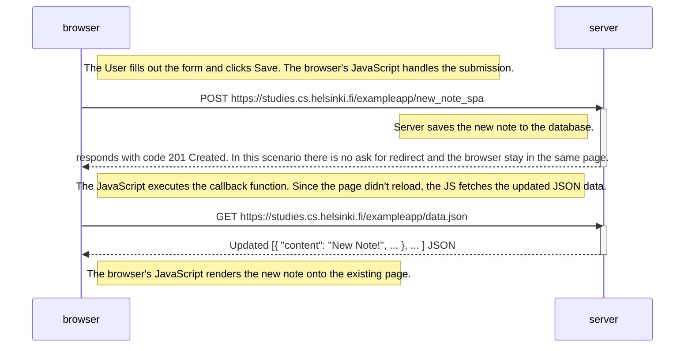

```mermaid
sequenceDiagram
    participant browser
    participant server

    Note right of browser: The User fills out the form and clicks Save. The browser's JavaScript handles the submission.

    browser->>server: POST https://studies.cs.helsinki.fi/exampleapp/new_note_spa
    activate server
    Note left of server: Server saves the new note to the database.
    server-->>browser: responds with code 201 Created. In this scenario there is no ask for redirect and the browser stay in the same page.
    deactivate server

    Note right of browser: The JavaScript executes the callback function. Since the page didn't reload, the JS fetches the updated JSON data.

    browser->>server: GET https://studies.cs.helsinki.fi/exampleapp/data.json
    activate server
    server-->>browser: Updated [{ "content": "New Note!", ... }, ... ] JSON
    deactivate server

    Note right of browser: The browser's JavaScript renders the new note onto the existing page.
```
